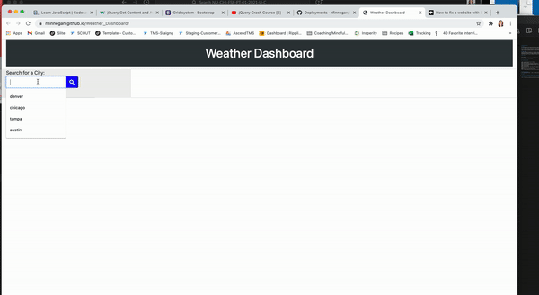

# Weather_Dashboard

## Project
For this application I was tasked with building a weather dashboard that will run in the browser and feature dynamically updated HTML and CSS. Because of that, the majority of the code this application uses is JavaScript & jQuery.

## Description 
In the 6th week of bootcamp, we spent our time learning about server-side APIs. After learning a few ways to call on APIS (XRT, AJAX, Fetch), I decided to use fetch since it is native to the browser.

## Challenges
This application was not without it's challenges. The third party API we were instructed to use only had 1 option that provided current weather and a forecast (One Call API). That API could only take latitude and longitude of a city, so I ended up having to use their geocoding API to convert a city name that the user entered into latitude/longitude that could be passed to the One Call API. Displaying localStorage items as cities were being entered was also an obstacle I couldn't overcome without it continuously rendering duplicates.

## User Story

```
AS A traveler
I WANT to see the weather outlook for multiple cities
SO THAT I can plan a trip accordingly
```

## Acceptance Criteria

```
GIVEN a weather dashboard with form inputs
WHEN I search for a city
THEN I am presented with current and future conditions for that city and that city is added to the search history
WHEN I view current weather conditions for that city
THEN I am presented with the city name, the date, an icon representation of weather conditions, the temperature, the humidity, the wind speed, and the UV index
WHEN I view the UV index
THEN I am presented with a color that indicates whether the conditions are favorable, moderate, or severe
WHEN I view future weather conditions for that city
THEN I am presented with a 5-day forecast that displays the date, an icon representation of weather conditions, the temperature, and the humidity
WHEN I click on a city in the search history
THEN I am again presented with current and future conditions for that city
```


## Deployed Application
Link to deployed application:   https://nfinnegan.github.io/Weather_Dashboard/

## Preview



## Resources

https://stackoverflow.com/questions/44177417/how-to-display-openweathermap-weather-icon